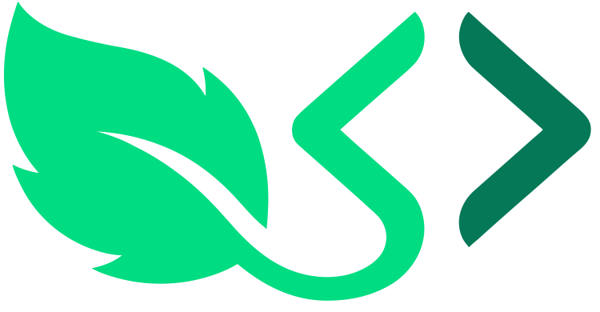

  
  <h1>MintMine Community</h1>
  
<strong>The IDE for Market Research.</strong>

  

    
    
    
  

  

    <a href="https://mintmine.dev">Website</a> •
    <a href="#-roadmap">Roadmap</a> •
    <a href="https://github.com/mintmine/community/discussions">Discussions</a> •
    <a href="https://x.com/tanya_masvita">Twitter/X</a>
  

---

## 🧐 What is MintMine?

MintMine is a market research tool built for **Engineers**.

We help builders identify user pain points and validate product ideas/features by scanning Reddit, GitHub, YouTube, and App Store reviews. Our AI filters out 90% of the noise (spam, generic praise) to surface actionable Opportunities—bugs, pricing complaints, missing features, etc., so you can not only build what users actually want but what they are willing to pay for.

---

## 📌 About This Repo

This repository is the official "Town Hall" for the MintMine community. This is where you can collaborate on the product roadmap.

- 💡 **[Ideas & Feature Requests](https://github.com/aeyonblack/mintmine-community/discussions/categories/ideas)**: Vote on what we build next.
- 🐛 **[Bug Reports](../../issues/new?template=bug_report.md)**: Tell us what's broken.
- 💬 **[General Chat](https://github.com/aeyonblack/mintmine-community/discussions/categories/general)**: Ask questions or share your research wins.
- 🗺️ **[Roadmap](#-roadmap)**: See what's shipping soon.

---

## ⚡ The Tech Stack

MintMine uses a hybrid architecture to balance performance with AI capabilities.

| Layer | Technology | Why? |
| :--- | :--- | :--- |
| **Frontend** | Vue 3 + Tailwind | Performance and tight styling control. |
| **API** | ASP.NET Core 8 | Type safety and raw speed for business logic. |
| **Worker** | Python + FastAPI | Leveraging `all-MiniLM-L6-v2` for local embeddings. |
| **Database** | Supabase (Postgres) | `pgvector` for semantic search. |

---

## 🗺️ Roadmap

We're building in public. Here's what's on our radar:

### 🔨 In Progress

| Feature            | Description                          |
| ------------------ | ------------------------------------ |
| Ingestion Pipeline | Data collection and filtering system |
| AI Clustering      | Smart grouping of similar complaints |

### 📋 Up Next

| Feature | Description                         |
| ------- | ----------------------------------- |
| Reddit  | Scan subreddits for user complaints |
| YouTube | Analyze video comments for feedback |

### 🔮 Planned

| Category         | Features                                                            |
| ---------------- | ------------------------------------------------------------------- |
| **Data Sources** | Hacker News, App Store, Google Play, Chrome Web Store, Product Hunt |
| **Integrations** | Jira, Linear, Slack, GitHub Issues                                  |
| **Features** | Custom keyword alerts, Team workspaces, API access                  |

### ✅ Shipped

| Feature                 | Status  |
| ----------------------- | ------- |
| Waitlist & early access | ✅ Live |

---

_Have a feature idea? [Open a feature request →](../../issues/new?template=feature_request.md)_

---

## 🤝 How to Contribute

Here's how you can shape the product and contribute:

1.  **Star this Repo:** It helps us reach more builders. ⭐
2.  **Vote on Features:** Go to [Discussions](https://github.com/aeyonblack/mintmine-community/discussions) and upvote the ideas you need most.
3.  **Report Bugs:** If you're in the Beta, log issues using our [Issue Templates](../../issues/new/choose).

---

## 🔗 Stay Connected

|                |                                               |
| -------------- | --------------------------------------------- |
| 🌐 **Website** | [mintmine.dev](https://mintmine.dev)          |
| 📧 **Email** | hi@mintmine.dev                               |

---

  
Built with 💚 by <a href="https://x.com/tanya_masvita">Tanya Masvita</a>

  Copyright © 2025 MintMine

